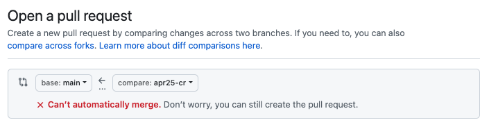
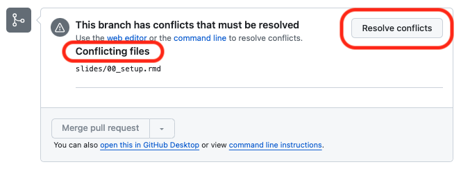
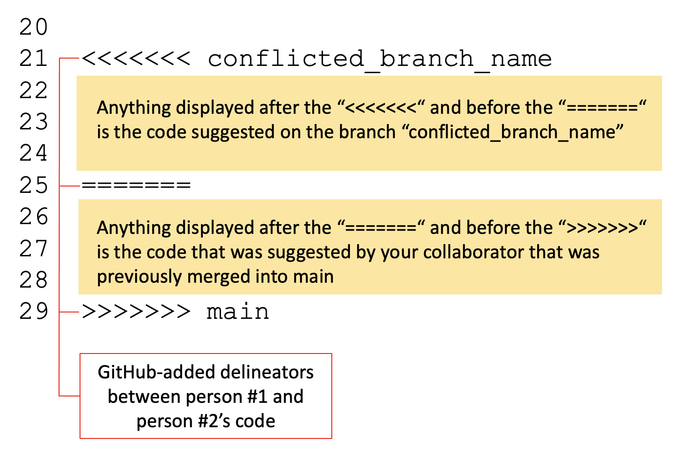

# Group Workflow 

## Outline for this section

Now, we're going to learn about working collaboratively using Git and GitHub.  

- Setting up a shared repository
- First Commit
- Collaborative Routes
    - Independent Work
    - Code Review
    - Direct Edits
- Big picture: Tracking Changes outside of Git
- Practice

## Set up

- **Find a partner:** One of you will be the *lead researcher*, and the other will be your *colleague*.
- **Decide roles:** The lead researcher will create the repository, and the colleague will contribute to it.

## Create your repository: Person 1
*One of you will follow these instructions and one will follow instructions on the next slide.*

### **Lead researcher (Person 1):** Create a new repository on GitHub.
- Go to GitHub, click on the "+" icon in the top-right corner, and select `New repository`.
- Follow the same instructions as we did in the solo exercise to create a new repository (add a README, choose a license, etc.).
- Add your colleague as a collaborator by going to `Settings` > `Collaborators` > `Add people`. Ask your colleague for their GitHub username and add them to this repository.

## Join the repository: Person 2
*If you did not follow the person 1 instructions, follow these!*

### **Person 2 (Colleague):** Accept the invitation to collaborate on the repository.
- Check your email for an invitation to collaborate on the repository.
- Accept the invitation by clicking on the link in the email.

## Clone the repository
### **Both:** Clone the repository 
- Go to the main page of your repository clicking on the green `Code` button and copying the URL. Then, navigate to the location where you will clone your repository and run the following command in your terminal:

```bash
git clone {repository URL}
```

## Check the status of your repository

Now that you both have the repository cloned, we will set ourselves up following the same steps as we did this morning. Let's redo what we did this morning:

Type `git status`. The results shows you that no changes have been made yet:

```bash
Biostat-MBP13-20:life-expectancy corinneriddell$ git status
On branch main
Your branch is up to date with 'origin/main'.

nothing to commit, working tree clean
```

## Determine the branch you are on
Type `git branch`. This shows you that you are currently on the main branch.

```bash
Biostat-MBP13-20:life-expectancy corinneriddell$git branch
* main
```

## Create a new branch

Now that we know that our repository is cloned, up to date, and on main, we can create a new branch to work on. 

- **Both:** Create a new branch with the following command:

```bash
git checkout -b {new-branch-name}
git branch
```
Typing `git branch` will show you that you are now on the new branch, though only the first line was *necessary* to create this branch. 

## Collaborative Routes

Now we will go through three different ways of working collaboratively on a project:

1. **Independent Work:** You each work on separate files and merge your own changes.
2. **Code Review:** Submit pull requests for code reviews without direct edits.
3. **Direct Edits:** Submit pull requests and make direct changes to each other's code.

## Collaborative Routes

While these different routes may seem ambiguous right now, you can think of pull requests as akin to "Track Changes" or "Comments" in Microsoft Word or Google Docs.  

**Collaborative route #1 (Independent work)** is like creating two separate documents and having them in a shared folder.  

**Collaborative route #2 (Code review)** is like having a shared document where you can leave comments for each other - think about when you leave comments on a word document for your colleague.  

**Collaborative route #3 (Direct edits)** is like having a shared document where you can make changes directly to your colleague's work - think track changes.

## Collaborative Route #1: Independent work  

You each work on separate files and merge your own changes. The repository will have two files, one that each of you made! 

## Collaborative Route #1: Add a file

- **Lead researcher:** Save the code file that you brought to this workshop in your repository! 
- **Colleague:** Save the code file that you brought to this workshop in your repository! 

Your files should have different names but if they do not, please make sure to rename one of them! 

## Collaborative Route #1: Commit our new file 

- **Both:** Add, commit, and push your file to GitHub as shown.

```bash
git add {file-name}.R
git commit -m "Initial commit with {file-name}"
git push origin {new-branch-name}
```

## Collaborative Route #1: Create a pull request  

We'll do the same thing we did earlier today: 

- Navigate to GitHub.com to your repository's URL. There should be a pale yellow 
banner informing you about the changes you just pushed. Click the button 
"Compare & pull request". Notice that the title is your commit message from the 
previous step. Scroll down. Look at the files that have been added. 
* The code is all shown in green, indicating that every line of code is new. 

## Collaborative Route #1: Merge the changes from your branch into main

**Both**: 
Again, this is the same as what you did earlier today: 

- Click on the green "Create pull request" button. Github will check that it 
is able to merge your branch with main without problems. Note the message "This
branch has no conflicts with the base branch". This means you are good to go!
- Click on the green "Merge pull request" button.  
- Click on the green "Confirm merge" button. 
- Click the "Delete branch" button.

## Collaborative Route #1: Let's look at our main branch now

**Both**:  
-  Go into the main `Code` page and take a look at the code on `main` (which should be the only existing branch in your repository).  
- You should see the files that *both* of you created in the previous steps.

## Collaborative Route #1: Recap

You have now successfully completed the first collaborative route. You each created a file, committed it, and merged it into the main branch. You worked on different files and had no merge conflicts or interaction, but now have access to each other's work! 


## Collaborative Route #2: Code Review

In this code review style collaborative approach, the lead researcher will make a new file, make changes to that file and push these to GitHub. The colleague will then review these changes by submitting comments on the pull request.

## Collaborative Route #2: Create a new branch  

**Lead researcher:** Create a new branch with the following command:

```bash
git checkout -b {new-branch-name}
git branch
```
Typing `git branch` will show you that you are now on the new branch, though only the first line was *necessary* to create this branch. 

## Collaborative Route #2: Lead Researcher makes changes to a file

- **Lead Researcher:** Make a change to the file you used above. You can add in a comment or a new line of code - something small. Save your file.

## Collaborative Route #2: Push Your Changes

- **Lead Researcher:** Add, commit, and push your new file or changes to your branch on GitHub.

```bash
git add {file-name}
git commit -m "{your description of what you changed}"
git push origin {your-branch-name}
```

## Collaborative Route #2: Create a Pull Request

- **Lead Researcher:** Go to your GitHub repository page. You should see a notification about your recent push. Click on "Compare & pull request" next to your branch.
- Fill in the details of the pull request, explaining what you've added or changed and why. 
- **This time, add your colleague as a reviewer. We will not immediately merge this in this time!**
- Submit the pull request.

## Collaborative Route #2: Colleague Reviews the Pull Request

- **Colleague:** Once the pull request is submitted, you should receive an email telling you that your lead researcher requested your review on PR #{X}.
- Click `view it on GitHub` and it will bring you to GitHub and there will be a yellow box at the top. 
- Click on `Add your review` in the yellow box. Then click `Review changes` in green in the right corner. 
- Leave comments on the pull request by clicking the plus signs next to chunks of code. You can leave multiple comments Your feedback can include suggestions, questions, or general feedback about the code. Focus on clarity, efficiency, and any potential errors you might notice.
- When you're finished commenting, click `Finish your review` in green in the top right. 

## Collaborative Route #2: Colleague Reviews the Pull Request  

- Submit your comments. You can either:  
    1. Comment: This submits feedback without explicitly approving the PR.
    2. Approve: This submits feedback and approves the PR for merging into main.
    3. Request Changes: Submit feedback that the other person needs to address before they can merge into main.

## Collaborative Route #2: Pull Request Review Options
1. Comment: This submits feedback without explicitly approving the PR.
- This will send the lead researcher an email with your comments on their code. The lead researcher can click `View it on GitHub` to see your comments. They can reply and/or merge the PR into main at this point.
- This can be used either as an FYI or to start a conversation about the code - e.g. maybe a certain function is new to you so you want to ask about why they chose to use that.
- You may want to use this if you have a workflow where you always want the person who wrote the code to do the merging.

## Collaborative Route #2: Pull Request Review Options
2. Approve: This submits feedback and approves the PR for merging into main.
- This will send the lead researcher an email with your comments that will also indicate that the PR is approved. 
- This option can be used as an FYI - e.g. telling them about an alternate function that they *could* use but do not have to.
- Either person can merge the PR into main. You can establish norms around how these work with your colleagues - there is no right answer! 

## Collaborative Route #2: Pull Request Review Options
3. Request Changes: Submit feedback that the other person needs to address before they can merge into main.
- This will send the lead researcher an email with your comments that will also indicate that the PR needs changes.
- This option can be used if you see something that needs to change before the PR can be merged - e.g. a function that is not working as intended.
- The lead researcher will need to address your comments before they can merge the PR into main.

*NOTE: Technically, the PR could be merged in without the changes, but this is not good practice.*

## Collaborative Route #2: Your turn [CR/LBW: THIS SLIDE NEEDS TO BE REFINED]  

- **Colleague:** Review the changes made by your lead researcher in the pull request. Leave comments on the code as needed. Choose whichever option you think is best.
- **Lead Researcher:** Review the comments made by your colleague. Make any necessary changes to your code based on the feedback.
- Add, commit, and push these changes to the same branch. This will automatically update the pull request.
- Colleague will receive an email saying that the lead researcher pushed one commit. At this point, the colleague can click `View it on GitHub` and verify that the changes are sufficient. 
- Now you can restart the process and either comment, comment and approve, or comment and request changes again!


## Collaborative Route #2: Finalizing the Pull Request [CR/LBW: THIS SLIDE NEEDS TO BE REFINED]  

- **Colleague:** Review the changes made by the lead researcher in response to your comments. If you're satisfied with the updates, approve the pull request.
- **Lead Researcher:** Once the pull request is approved, merge your changes into the main branch. 

## Collaborative Route #2: Recap  
 
We have now practiced using Git to do a code review! You used Git to review/check/comment on our colleague's work without emailing or copying/pasting code back and forth. The lead researcher made changes to their code based on your feedback, and you both worked together to finalize the pull request. 


## Collaborative Route #3: Direct Edits

**CR/LBW: DO WE WANT TO COVER THIS?**


In this scenario, after your colleague pushes their code, they will submit a pull request to you, and you will directly edit their code if needed. This may be useful if one person is stuck on a certain piece of the code, or if you are working very closely together on one script.  

## Collaborative Route #3: Create a new branch  

- **Colleague:** Create a new branch with the following command:

```bash
git checkout -b {new-branch-name}
git branch
```
Typing `git branch` will show you that you are now on the new branch, though only the first line was *necessary* to create this branch. 

## Collaborative Route #3: Colleague Creates a File

- **Colleague:** Make a change to the file you used above. You can add in a comment or a new line of code - something small. Save your file.  

## Collaborative Route #3: Push Your Changes

- **Colleague:** Add, commit, and push your new file or changes to your branch on GitHub.  

```bash
git add {file-name}
git commit -m "{your description of what you changed}"
git push origin {your-branch-name}
```

## Collaborative Route #3: Create a Pull Request

- **Colleague:** Go to your GitHub repository page. You should see a notification about your recent push. Click on "Compare & pull request" next to your branch.  
- Fill in the details of the pull request, explaining what you've added or changed and why.   
- **This time, add your lead researcher as a reviewer. We will not immediately merge this in this time!**  
- Submit the pull request.  

## Collaborative Route #3: Lead researcher makes direct edits  

- **Lead Researcher:** Review the code in the pull request. Look at the section with a comment asking for your help, make direct edits to the code in the pull request.

## Collaborative Route #3: Commit the Changes  

**CR/LBW: THIS SLIDE SHOULD BE REFINED ONCE WE PRACTICE THIS TOGETHER**  

- After making direct edits, push your changes back to the branch.    
- **Both:** Review the final changes together, discuss any further modifications, and then merge the pull requests into the main branch.  

## Collaborative Route #3: Recap

This route had you directly edited your colleague's code. This can be very useful when one person knows how to do something that another person is stuck on, or when the code is a collaboration. This may not be very common in your work, but is a valuable tool if you are helping someone with code!


## Merge conflicts

## Practicing a merge conflict

This occurs when XXX. 

## Practicing a merge conflict

**Both**: 
- Both partipiants should be on `main` now. If you are not, please do `git checkout main` and `git pull origin main` to make sure you are up to date.
- Both participants make and checkout a new branch: `git checkout -b {new-branch-name}`
- Both participants make a change to the same line of code in the same file. You can choose whichever file you want to use. Edit the last line of the file to make this easier to use for practice. 
- **Lead Researcher**: Add, commit, and push your changes to your branch. Create a pull request and merge your changes into main. 
- **Colleague**: Add, commit, and push your changes to your branch. Create a pull request and you will not be able to merge into main. 

## Practicing a merge conflict

**Colleague**: You will see the following. 

```{r, echo=F, out.width='75%'}

```

## Practicing a merge conflict

**Colleague**: Click on `View Pull Request` to begin resolving the merge conflict. When you click on `View Pull Request`, you will see the following. 

```{r, echo=F, out.width='75%'}

```

## Practicing a merge conflict

**Colleague**: Click on `Resolve conflicts` to begin resolving the merge conflict. When you click on `Resolve conflicts`, you will see the following:

```{r, echo=F, out.width='75%'}

```


## Practicing a merge conflict

**Both**: Together, look at the code in the file. Decide which edits you will keep. For this exercise, it is abritrary which edits you keep. However, keep in mind that in real life you will make this decision in an informed way. 

When you choose what to keep, take out all of the `>>>` and `===` and `<<<` lines, as well as the lines from the person whose code you are not keeping. When you are finished, click `Mark as resolved` in the top right corner. 

Note: You are still doing all of this on GitHub, not in your terminal.

## Practicing a merge conflict

Now that you have clicked `Mark as resolved`, you will see a green checkmark next to the file name, and it will say `Resolved` in the top right corner. There will also be a green button in the top right corner that says `Commit merge`. Click on this button. 

This brings you back to the page you are familiar with, where you can merge into main. Click `Merge pull request` and then `Confirm merge`. You can delete the branch as you usually do. 

You have just resolved your first merge conflict! 

**CR/LBW: add conclusion slides**
**make sure to mention that if all else fails, they should blow up their repo.**


