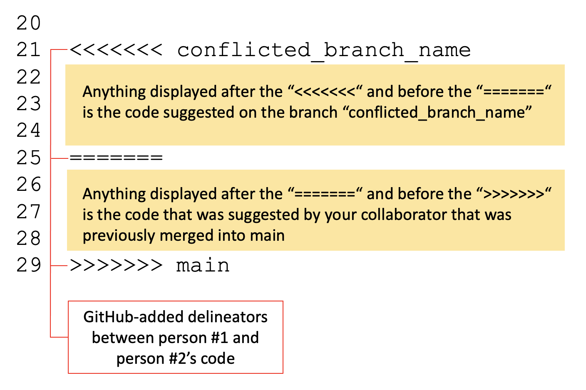

# Group Workflow 

## Outline for this section

In the previous section, you got up and running with working alone in Git and 
GitHub. During this section, we're going to learn how to collaborate with others
using Git and GitHub. We will: 

- Set up a shared repository
- Make a first commit
- Cover three routes for collaboration: 
    - Independent Work
    - Code Review
    - Working on the same files
        - Practice resolving a merge conflict

## Setup

To get the most out of this section of the training, you need a training buddy.
One of you will be the *lead researcher*, and the other will be the *colleague*.
The lead researcher will create the repository, and the colleague will contribute to it.

**Lead Researcher: Create a new repository on GitHub**

- Go to GitHub, click on the "+" icon in the top-right corner, and select `New repository`.
- Follow the same instructions as we did in the solo workflow to create a new 
repository (add a README, choose a license, etc.).
- Add your colleague as a collaborator by going to 
`Settings` > `Collaborators` > `Add people`. Ask your colleague for their 
GitHub username and add them to this repository.

**Colleague: Join the repository**

- Check your email for an invitation to collaborate on the repository.
- Accept the invitation by clicking on the link in the email.

**Both: Clone the repository**

- Go to the main page of the repository clicking on the green `Code` button and
copying the URL. Then, in Bash/Terminal navigate to the location where you will
clone your repository and run the following command:

```
git clone {repository URL}
```

## Get oriented to the new directory

- Navigate into your repository by typing `cd {repo-name}`
- Type `git status`. The results shows you that no changes have been made yet:

```
Biostat-MBP13-20:collabo-repo corinneriddell$ git status
On branch main
Your branch is up to date with 'origin/main'.

nothing to commit, working tree clean
```

- Type `git branch`. This shows you that you are currently on the main branch.

```
Biostat-MBP13-20:life-expectancy corinneriddell$git branch
* main
```

- **Both:** Create a new branch. Now that we know that our repository is cloned,
up to date, and on main, we can make a new branch to work on: 

```
git checkout -b {new-branch-name}
git branch
```

Typing `git branch` will show you that you are now on the new branch, though 
only the first line was *necessary* to create this branch. 

## Collaborative Routes

In general, there are three ways to work collaboratively on a project:

1. **Collaborative route #1 (Independent work)**: You each work on separate files and merge your own changes. It is similar to creating several separate documents and 
storing them in a shared folder for you both to view.  
2. **Collaborative route #2 (Code review)**: Submit pull requests for code reviews without direct edits. It is similar to having a shared document where you can leave comments for each other - like when you leave comments on a MS Word document for your colleague.  
3. **Collaborative route #3 (Working on the same files)**: You both work on the same file and merge in your changes. Sometimes this leads to merge conflicts so additional care is needed. It is similar to having a shared document where you 
can make changes directly to your colleague's work -- think about working collaboratively on a document in the cloud where both individuals can edit the
document at the same time, but weird things might happen if you are working on the same sentence at the same time.

We will cover each collaborative route below.

### Collaborative Route #1: Independent work  

You each work on separate files and merge your own changes. To start, the 
repository will have two files, one that each of you made. In general, you could
maintain several files, each of your working on the specific files that make 
sense but never editing each other's files.

Let's practice this workflow now:

- **Lead researcher:** Save a code file that you brought to this workshop in the shared repository. 
- **Colleague:** Save a code file that you brought to this workshop in the shared repository. If 
your file has the same name as the lead researcher's file, rename it now.
- **Both:** Add, commit, and push your respective files to GitHub:

```
git add {file-name}
git commit -m "Initial commit with {file-name}"
git push origin {new-branch-name}
```

If the output from the push command looks successful, you are now ready to create
a pull request following the same process we used in the solo workflow section.

- **Both:** Navigate to GitHub.com to your repository's URL. There should be a pale yellow 
banner informing you about the changes you just pushed. Click the button 
"Compare & pull request". Notice that the title is your commit message from the 
previous step. Scroll down. Look at the files that have been added. 
- The code is all shown in green, indicating that every line of code is new. 
- Merge the changes from your branch into main
- Click on the green "Create pull request" button. Github will check that it 
is able to merge your branch with main without problems. Note the message "This
branch has no conflicts with the base branch". This means you are good to go!
- Click on the green "Merge pull request" button.  
- Click on the green "Confirm merge" button. 
- Click the "Delete branch" button.

Both of your files have been merged into the main branch. Let's take a look. Go 
into the main `Code` page and take a look at the code on `main` (which should be
the only existing branch in your repository). You should see the files that 
*both* of you created in the previous steps.

**Recap**

* You have now successfully completed the first collaborative route. You each 
created a file, committed it, and merged it into the main branch. You worked on 
different files and had no merge conflicts or interaction, but now have access 
to each other's work! 

* In this workflow, you could continue working independently on your file in 
the shared repo and add other files as you go along. 

* ❗ Take care: Now that you are working together, be sure
to use `git pull origin main` to frequently grab any changes your colleague made to the 
repository. You should be doing this already, but it is even more important 
when you are working together so you can stay up to date on whatever changes
have been made to the repository.

### Collaborative Route #2: Code Review

In Collaborative Route #2, the lead researcher will make a new file, make 
changes to that file and push these to GitHub. The colleague will then review 
these changes by submitting comments on the pull request. 

Let's practice this workflow now:

**Lead researcher steps:** 

- Checkout main, and pull down the changes

```
git checkout main
git pull origin main
git status
```

- Create a new branch. Pretend it is the next day and include this date in the 
branch name alongside your initials:

```
git checkout -b {new-branch-name}
git branch
```

- Make and save a change to the file you added in the previous step.
You can add in a comment or a new line of code - something small is good. Save 
your file.
- Add, commit, and push your changes to your branch on GitHub:

```
git status
git add {file-name}
git commit -m "{your description of what you changed}"
git push origin {your-branch-name}
```

- Go to your GitHub repository page. You should see a notification about your 
recent push. Click on "Compare & pull request" next to your branch.
- ❗ **NEW STEP ALERT**: Fill in the details of the pull
request, explaining what you've added or changed and why. 
- ❗ **NEW STEP ALERT**: Add your colleague as a 
reviewer. We will not immediately merge this in this time!
- Submit the pull request.

**Colleague steps:**

- Once the pull request is submitted, the colleague should receive an email telling them 
that the lead researcher requested their review on PR #{X}.
- Click `View it on GitHub` and it will bring you to GitHub and there will be a 
yellow box at the top. 
- Click on `Add your review` in the yellow box. Then click `Review changes` in green in the right corner. 
- Leave comments on the pull request by clicking the plus signs next to chunks 
of code. You can leave multiple comments. Your feedback can include suggestions,
questions, or general feedback about the code. Focus on clarity, efficiency, and 
any potential errors you might notice.
- When you're finished commenting, click `Finish your review` in green in the top right. 
- Submit your comments. You have three review options:

<br />

Let's take a moment to talk briefly about each of these review options. 

|  |   |
|-|---------|
|✅ **Comment**   | This submits feedback without explicitly approving the pull request. This will send the lead researcher an email with your comments on their code. The lead researcher can click `View it on GitHub` to see your comments. They can reply and/or merge the pull request into main at this point. This can be used either as an FYI or to start a conversation about the code - e.g. maybe a certain function is new to you so you want to ask about why they chose to use that. You may want to use this if you have a workflow where you always want the person who wrote the code to do the merging.  |
|✅ **Approve**|This submits feedback and approves the PR for merging into main. This will send the lead researcher an email with your comments that will also indicate that the pull request is approved. This option can be used as an FYI, e.g., telling them about an alternate function that they *could* use but do not have to. Either person can merge the pull request into main. You can establish norms around how these work with your colleagues - there is no right answer! |
|✅ **Request Changes**|Submit feedback that the other person needs to address before they can merge into main. This will send the lead researcher an email with your comments that will also indicate that the PR needs changes. This option can be used if you see something that needs to change before the pull request can be merged - e.g. a function that is not working as intended. The lead researcher will need to address your comments before they can merge the pull request into main. *Technically, the PR could be merged in without the changes, but this is not good practice.*|
|  |   |

**Lead Researcher:**

- Review the comments made by your colleague. Make any necessary changes to your code based on the feedback.
- Add, commit, and push these changes to the same branch. This will automatically update the pull request.

**Colleague:**

- You will receive an email saying that the lead researcher pushed one commit. At this point, the colleague can click `View it on GitHub` and verify that the changes are sufficient. 
- Review the changes made by the lead researcher in response to your comments. If you're satisfied with the updates, approve the pull request.

**Lead Researcher:** 

- Once the pull request is approved, merge your changes into the main branch. 

**Recap** 

- You have successfully completed the second collaborative route. You used Git to
review/check/comment on your colleague's work without emailing
or copying/pasting code back and forth. The lead researcher made changes to 
their code based on your feedback, and you both worked together to finalize the 
pull request. 

- Similar to the previous workflow, collaborators can work independently, but 
request review of each other's work.
 
### Collaborative Route #3: Working on the same files 

In this scenario, imagine that the lead researcher has already created and 
committed an analysis file. The colleague then wants to make direct changes to 
that file or extend the analysis. This is a valid and commonly used workflow, 
and works well if both people are working sequentially and pulling from main 
often to pull down any changes made to the repo as their collaborators work.

This diagram shows how both Lauren and Corinne can work on the same file, 
sequentially over time, each pulling from main, making changes, and merging their
changes back into main before the other person works:


However, this collaborative route leaves room for the dreaded merge conflict.

Merge conflicts can be a source of stress for many GitHub users. While they can
be scary, you are in good company when you have your first merge conflict --
everyone has a merge conflict eventually. 

What is a merge conflict, you might ask, and how does it happen? Well, a merge 
conflict can happen if you and a colleague both pull from main at the same 
time and proceed to edit the same location on the same file. If colleague #1 
merges their changes into main, then when colleague #2 
goes to merge their changes into main, GitHub doesn't know what changes to keep.


If this seems a little convoluted, it is your lucky day. We will set the stage
for a merge conflict and practice resolving it with our buddy. 

**Creating a merge conflict**

- Both researchers should be on `main` now. If you are not, please do 
`git checkout main` and `git pull origin main` to make sure you are up to date.
- Make and checkout a new branch: `git checkout -b {new-branch-name}`. Each of
you should call their branch something different from the other researcher.
- Together, choose one file and one line location on the file that you will each
edit separately on your laptops.
- **Lead researcher only:** add, commit, and push your changes to your branch. 
Then, create a pull request and merge your changes into main. 
- **Colleague:** Your turn. Add, commit, and push your changes to your branch. 
Then, create a pull request. 😱 Merge conflict! You will not 
be able to merge into main. 

Deep breaths. Let's walk through how to resolve the merge conflict. 

The colleague with the conflict will see the following. Colleague, follow these steps!
Lead researcher, watch your colleague's screen to follow along:


Click on `View Pull Request` to begin resolving the merge conflict. When you click on `View Pull Request`, you will see the following: 


Click on `Resolve conflicts` to begin resolving the merge conflict. When you click on `Resolve conflicts`, you will see the following:



Together, look at the code in the file. Decide which edits you will keep. For
this exercise, it is arbitrary which edits you keep. However, in practice you 
will make this decision in an informed way. 

When you choose what to keep, delete the `>>>` and `===` and `<<<` lines, as 
well as the lines from the person whose code you are not keeping. When you are 
finished, click `Mark as resolved` in the top right corner. Now that you have 
clicked `Mark as resolved`, you will see a green check mark next to the file 
name, and it will say `Resolved` in the top right corner. There will also be a 
green button in the top right corner that says `Commit merge`. Click on this 
button. This brings you back to the page you are familiar with, where you can 
merge into main. Click `Merge pull request` and then `Confirm merge`. You can 
delete the branch as you usually do. 

**Recap**

- You have just resolved your first merge conflict! 
- In this route you worked together on the same files. If you had edited different
sections of the file, you could successfully merge both of your changes into main. 
In this instance, both of you edited the same line of code, which created a 
merge conflict. You resolve the merge conflict. 
- To minimize the change of merge conflicts, make sure you do `git pull origin main` before you 
start your day's work to pull down the most recent version of the repo. If you do
get a conflict, you know how to resolve it. You will need to make a decision about
which version of the code to keep. It should be clear based on what you hope to 
accomplish in the analysis. 


